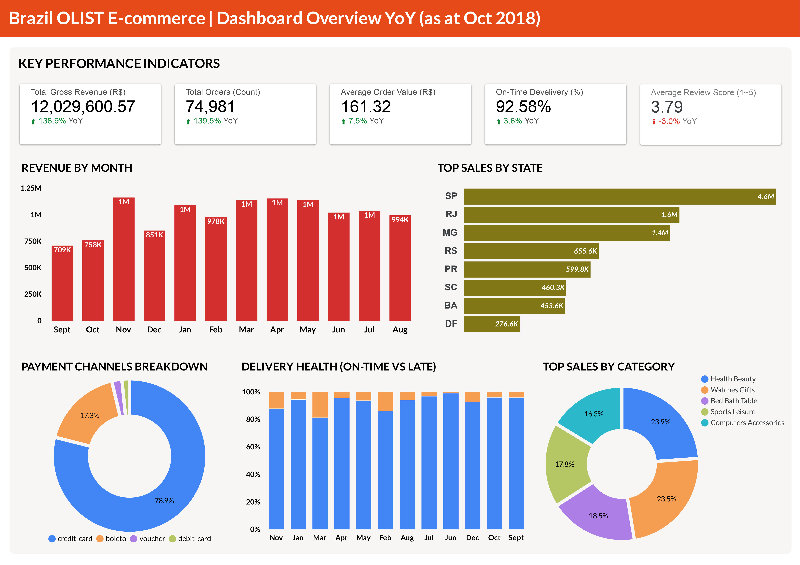
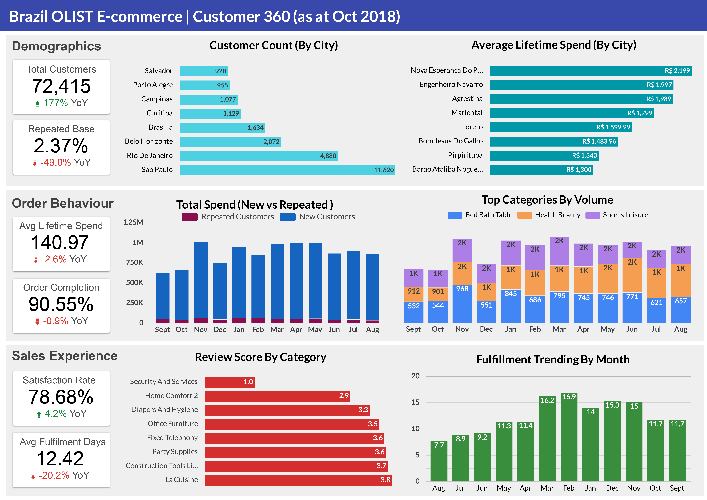

# End-to-End Data Pipeline and Executive Dashboards for Brazil E-Commerce (Olist)

ELT Pipeline with Meltano, dbt, Dagster & Looker Studio

## 🚀 Overview

This project implements a modern, end-to-end data pipeline and analytics workflow for the **Brazilian E-Commerce Public Dataset (Olist)**. Using **Meltano**, **dbt**, **BigQuery**, and **Dagster**, raw CSV data is transformed into a clean, analytics-ready schema powering two strategic dashboards in **Looker Studio**:

- 📊 **E-commerce Overview Dashboard** – High-level sales KPIs and operational metrics  
- 👤 **Customer 360 Dashboard** – Deep insights into customer segments and experience

The solution simulates how digital businesses can build **data infrastructure** to drive **product decisions**, **customer intelligence**, and **growth strategies**.

---

## 🧱 Architecture

```
Raw CSV Data → Meltano (EL) → BigQuery → dbt (Staging → Core → Marts) → Dagster (Orchestration) → Looker Studio (Dashboards)
```

---

## 🛠️ Tech Stack

| Layer        | Tool/Platform            |
|--------------|--------------------------|
| Ingestion    | Meltano (tap-csv → target-bigquery)  
| Warehouse    | Google BigQuery  
| Transformation | dbt (Data Build Tool)  
| Orchestration | Dagster  
| BI & Dashboards | Looker Studio  
| Exploration  | Jupyter Notebooks (Python, pandas, seaborn)  
| Version Control | Git  

---

## 📊 Dashboard Highlights

### 🛍️ E-commerce Overview Dashboard

**Purpose**: Provide executives and product teams with visibility across sales, fulfilment, and review performance

- Revenue KPIs: Total Revenue, AOV, Sales Trend
- Operations: On-Time Delivery %, Freight Costs, Fulfilment Lag
- Product Performance: Top Categories, Seller Metrics
- Region: Sales by State, Monthly Trends, Category Mix



📎 [View Interactive Dashboard](https://lookerstudio.google.com/reporting/6bc1d14d-ad4d-4c80-8fdb-4185c7009335)


### 👤 Customer 360 Dashboard

**Purpose**: Equip marketing and CRM teams with data to better segment and engage customers

- Demographics: Customer Distribution by City/State
- Behavior: Completed Orders, Repeat Purchase Rate
- Experience: Fulfilment Days, Review Scores
- Growth: YOY Growth, Monthly Active Customers



📎 [View Interactive Dashboard](https://lookerstudio.google.com/reporting/d4ae5458-656c-4df2-8329-34a251bea08e)


All dashboards are powered by **star schema marts** built in dbt and optimized for Looker Studio performance and scalability.

### 🧩 Data Model: Star Schema


📁 [Download DBML File](dashboards/brazil_olist_star_schema.dbml)

---

## 📂 Project Structure

```
.
├── meltano-ingest-olist/     → Meltano config (EL)
├── olist_dbt/                → dbt models (Staging, Core, Marts)
├── olist_dagster/            → Dagster orchestration pipeline
├── notebooks/                → Exploratory notebooks (EDA, profiling)
├── data/                     → Raw CSVs (Olist dataset)
├── .keys/                    → GCP service account keys (excluded from Git)
└── README.md
```

---

## 🔄 Pipeline Flow

1. **Extract & Load (Meltano)**  
   Loads 9 raw CSVs into BigQuery with tap-csv → target-bigquery  
   Validates schema and formats for ingestion

2. **Transform (dbt)**  
   - **Staging Models**: Clean & normalize raw data (e.g., null handling, type casting, Portuguese-English translation)
   - **Star Schema**:  
     - `fact_orders`: Order, product, and delivery metrics  
     - `dim_customers`, `dim_products`, `dim_sellers`, `dim_dates`, `dim_reviews`  
   - **Testing**: Null, uniqueness, accepted values, range tests using `dbt-expectations`

3. **Orchestration (Dagster)**  
   Manages dbt run/test/mart execution via asset-based dependency graph

4. **Visualization (Looker Studio)**  
   Live connections to BigQuery marts  
   Two dashboards built with reusable filters and standardized metrics

---

## ✅ Key Business Use Cases Supported

- Monitor sales and revenue trends by geography and category  
- Track fulfilment performance and on-time delivery rates  
- Evaluate customer experience through review scores and delivery lags  
- Segment customers by region and repeat behavior  
- Enable marketing and product teams to make data-driven decisions

---

## 🧪 Data Quality & Validation

- dbt tests: not_null, unique, accepted_values, range  
- Dagster ensures test success before continuing pipeline  
- Manual validation of edge cases (e.g., delivery delay logic, city name normalization)

---

## 📈 Additional Analysis (Python)

Notebook: `notebooks/clv_analysis.ipynb`  
Exploratory modeling of Customer Lifetime Value (CLV), churn cohorts, and retention trends using pandas and seaborn (non-production).

---

## 🔧 Next Steps (Optional Enhancements)

- Add scheduling via Dagster cron
- Automate pipeline via CI/CD with GitHub Actions
- Expand metrics (promo data, marketing costs)
- Integrate alerting and pipeline monitoring tools
- Build a central dbt documentation site

---

## 👨‍💻 Contributors

This project was created as part of the SCTP Advanced Certificate in Data Science & AI (NUS) – Module 2.

Built and maintained by:  
**Eugene Soh** – Product & Transformation Leader | AI, Data & Digital Strategy  
https://www.linkedin.com/in/eugsoh/

---

<details>
  <summary>⚙️ Full Environment & Setup Instructions (Click to Expand)</summary>

## 🔧 Setup Instructions

### 1. Environment Setup

1. **Create and activate conda environment:**
   ```bash
   conda env update -f environment.yml
   conda activate elt
   ```

2. **Install Python dependencies:**
   ```bash
   pip install -r requirements.txt
   ```

3. **Setup Google Cloud Platform:**
   - Create a GCP project
   - Enable BigQuery API
   - Create a service account with BigQuery permissions
   - Download service account key and place in `.keys/gcp-key.json`
   - Authenticate with gcloud CLI:
     ```bash
     gcloud auth application-default login
     ```

---

### 2. Data Ingestion Setup (Meltano)

1. **Navigate to Meltano directory:**
   ```bash
   cd meltano-ingestion
   ```

2. **Run data ingestion:**
   ```bash
   meltano run tap-csv target-bigquery
   ```

---

### 3. Data Transformation Setup (dbt)

1. **Navigate to dbt project:**
   ```bash
   cd dbt_project
   ```

2. **Install dbt dependencies:**
   ```bash
   dbt deps
   ```

3. **Run dbt transformations:**
   ```bash
   # Run staging models
   dbt run --select path:models/staging/

   # Run data quality tests
   dbt test --select path:models/staging/

   # Run marts models
   dbt run --select path:models/marts/
   ```

---

### 4. Orchestration Setup (Dagster)

1. **Navigate to Dagster orchestration:**
   ```bash
   cd dagster_orchestration/orchestration_pipeline
   ```

2. **Install Dagster dependencies:**
   ```bash
   pip install -e ["dev"]
   ```

3. **Start Dagster UI:**
   ```bash
   dagster dev
   ```

4. **Access Dagster UI** at `http://localhost:3000`

---

### 5. Run the Complete Pipeline

#### Option 1: Manual Execution
```bash
# 1. Ingest data
cd meltano-ingestion
meltano run tap-csv target-bigquery

# 2. Transform data
cd ../dbt_project
dbt run --select path:models/staging/
dbt test --select path:models/staging/
dbt run --select path:models/marts/

# 3. Refresh BI dashboards
https://lookerstudio.google.com/reporting/6bc1d14d-ad4d-4c80-8fdb-4185c7009335
https://lookerstudio.google.com/reporting/d4ae5458-656c-4df2-8329-34a251bea08e

# 4. Run analysis
cd ../notebooks
jupyter notebook clv_analysis.ipynb
```

#### Option 2: Orchestrated Execution (Recommended)
```bash
# Start Dagster UI
cd dagster_orchestration/orchestration_pipeline
dagster dev

# Access UI at http://localhost:3000
# Trigger asset materialization for the complete pipeline
```

</details>
